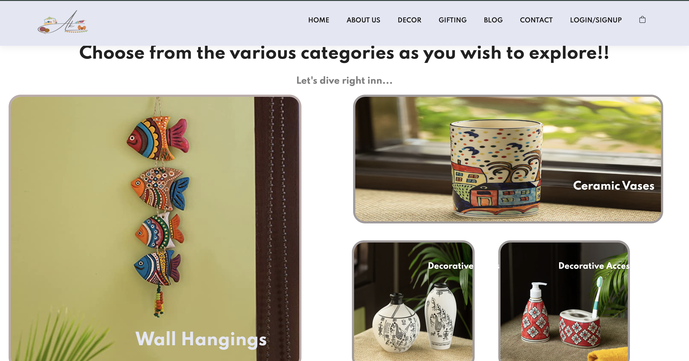
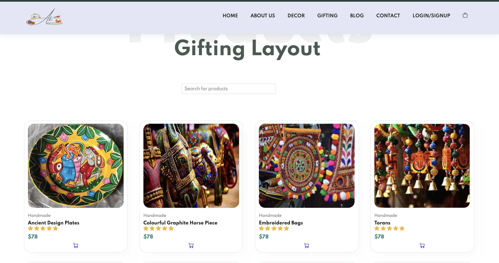
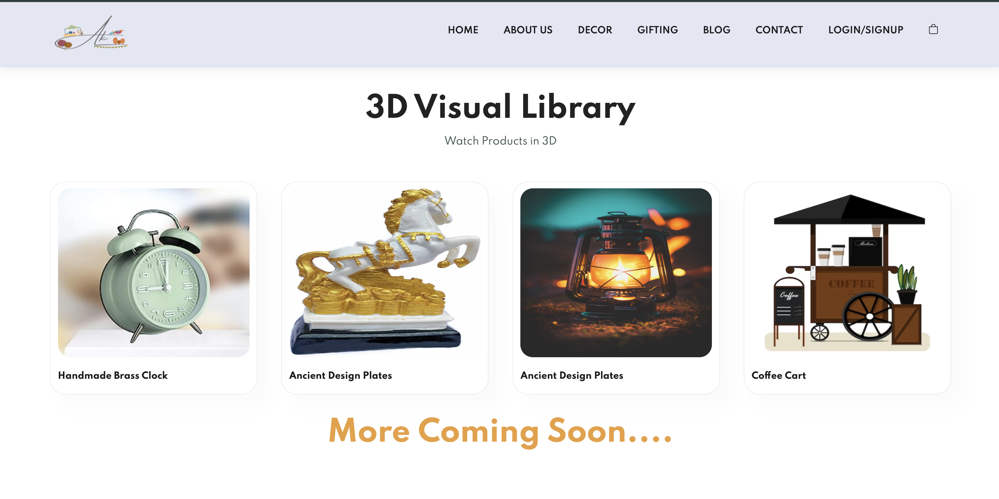
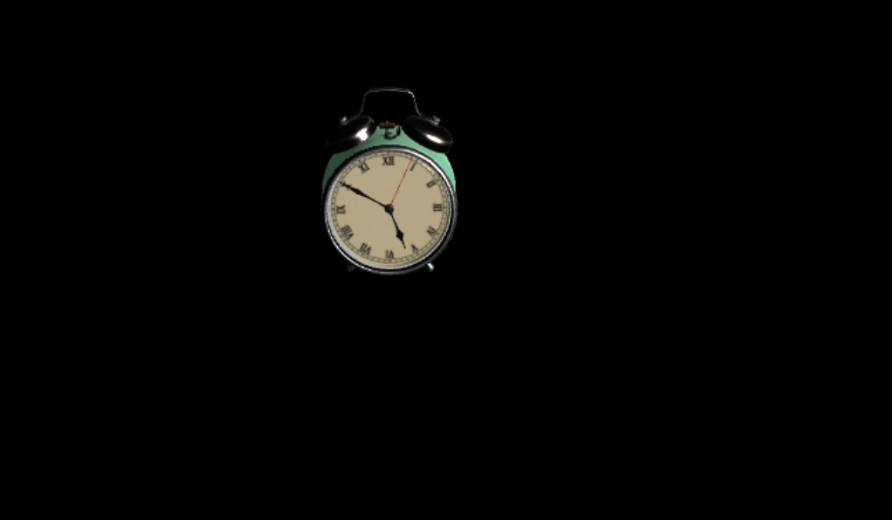
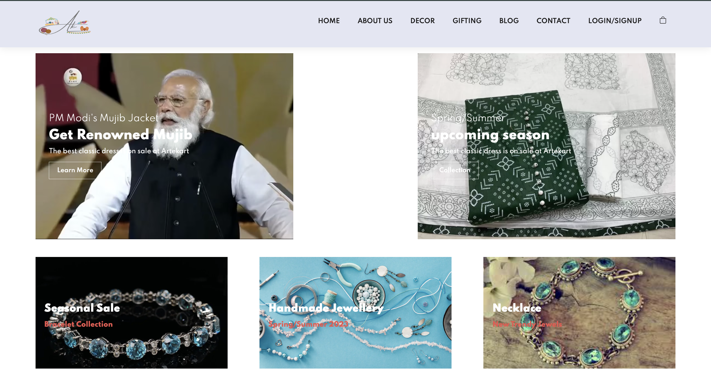

# Artekart 🎨🛒

Artekart: An e-commerce platform empowering handicraft artists with shopping features, 3D product models, and a supportive community.

## Overview 🚀 

Artekart: A marketplace built for handicraft artists, offering:

* Immersive shopping with 3D product models
* Artist storefronts for personalized branding
* Community forums for connection and collaboration

### Upcoming Features and Extensions 🏃

1. Exciting Updates like more 3d products availaibility
2. Support on mobile devices and tablets.

### UI Design

















## Getting Started

1. Clone the repository
```bash
git clone https://github.com/Vr978/Askpixie.git
```
2. Install packages
```bash
npm install
```
3. Initialize your mongodb atlas database and add your database link in src/db/conn.js
4. Run the app
```bash
cd src
node app.js
```
5. For 3d models create a new terminal without stopping/deleting existing terminal and
```bash
cd 1
npm run dev
```
6. Create 3 more terminals for other 3 models
Note: Creating New Terminal is done, because 3d models are created using React. We will update and integrate them with main app in next update.

   
